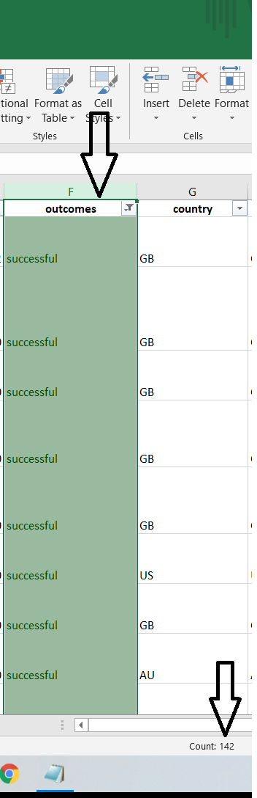

# An Analysis of the Kickstarter Campaigns

## Overview:

  The Kickstarter Campaign is a data series that collected a vast range of measurables within an array of categories that helped Louise visually compare outcomes based on campaign launch dates as well as outcomes based on funding goals per project. The visual analysis provided to Louise will then determine a timeline and a reccommended number of means to get the full benefit in order for her own play to become successful.

## Analysis and Challenges:
  The following analysis was preformed by pinpointing the questions that Louise had in order to get an understanding for the project she is intending on starting. When filtering the information given to us we determined as her project was focused on a play that it was best to measure the success of all 1,369 plays that were included. When exposing the trends within the data series we were able to determine a time frame for success within a seasonality range of May to July as well as a effective cost that help Louise budget the project. 
 
 One challenge I did encounter when beginning the “Outcomes Based on Goals” table, was no trusting my COUNTIF statement. After writing the COUNTIF formula within the first column and receiving the results I double guessed myself. Before writing the formula, I was anticipating an answer of 142 successful projects with a goal amount less than 1,000. After running the formula, I received a result of 141. I believed my answer was 142 because I was filtering the main Kickstarter data so the sheet would only show the following filters of “success”, “plays”, then manually selecting the goals amount that were less than 1,000. By me filtering and checking the count I was generating a number of 142. Now my COUNTIF formula was generating the results of 141 making me think I was somehow including an additional piece of data. After time went on and I carried on with the next rows I realized that all numbers were off by 1 when comparing to the count in my manual filtering methods. I then realized when I was manually filtering and highlighting the amount of data, that I was also including the header as it sits on row 1. The lesson this taught me was that it is acceptable to double check the work but make sure you are doing it correctly as well as trusting Excel and its formulas.

## Results:

### Theater Outcomes by Launch Date Conclusions
One conclusion we can make based on the Theater Outcomes by Launch Date is that the months of May, June, and July tend to be the most popular time that campaigns are launched but does not show vailed reasoning of why Louise should launch her play during these months of the year.  Of the 1,369 campaigns, 33% are launched in this 3-month time gap. The mean of total successful launched plays is 69.1. This 3-month period is well above the average sitting at 111,100, and 87. The mean of failed play campaigns based on launch date is 41.1. Also, during this grouping, the failed plays per campaign based on launch date was also above average sitting at 52,49,50. Now competition could play into factor in determining if these plays were to be successful or not.
  
Another conclusion we can make based off the Theater Outcomes by Launch Date is that the month of December play campaigns have a close to 50% chance of either running a successful or failed campaign. 

  
### Outcomes Based on Goals Conclusion
One conclusion we can determine from our Outcomes based on Goals charts and graph is that when launching a play campaign, it is recommended to limit the goal amount to be less than $4,999. Our current data shows that when play campaigns are budgeted for less than $4,999 then there is a higher chance of success and a lower chance of failure. When we begin to exceed the goal of $5,000 the success rate drops from 73% to 55% and the failure rate rises from 27% to 45%. Our data shows that when kickstarting a goal between less than $1,000 to $4,999 there were a total of 720 projects. Of those 720 projects 529 (73%) projects were successful and 191 (27%) projects failed.

### Limitations
Given the current data set does contain 4,115 different campaigns over a nine-year time span there are different factors or limitations that could cause various of outcomes.  Some limitations that could determine the success or failure of a play campaign could simply be actors or actress within the play, location of the play, accuracy of information, and incomplete dataset. Some limitations that others would categorize as an outlier when analyzing the plays campaigns is if there were a well-known actor or actress staring in one of the plays. If this was a condition, it could have played a valuable reason of why the play could have been successful or not. 
 
When filtering the dataset by country, one limitation could also determine the success or failure of one of the recorded plays. If one of the campaigns were to be hosted in a major metropolis area such as popular theater cities such as New York City, Chicago, or Los Angeles compared to a less populated city our data could also be misinterpreted. AS our charts only show all campaigns that were hosted within the country, I would determine that the success and failure rate per city would also be able to provide beneficial data
  
 As we are only provided the data, it is important to know that the information we receive is also accurate. If we are receiving reports of these campaigns through multiple different sources our analysis could be skewed as well. Our limitation is not knowing if each parent category and subcategory is providing a consistent source of information in order to create our spreadsheet.
 
 Within New York City there is an average of 38 new production Broadway plays per year.  As our campaign covers a nine-year span spread across 19 different countries, I believe our sample size is incomplete or does not account for all that is being categorized as a play. Making sure we have a clear break down of what we are considering a “play” does hold back accurate information that can also change the outcomes of our visual graphs.

### Additional Tables and Graphs
For further understanding and more in-depth knowledge of the Kickstarter information I would recommend an additional filter for the Theater Outcomes by Launch Date. The filter I would add would be countries. I feel it would be necessary information for Louise to understand the success and failure rates that vary between country to country.
	
After having the chance to filter Outcomes by Launch Date for each of the 19 countries that are highlighted within this data series, I would then take the additional steps to create a column chart comparing all the countries outcomes by launch date for the information to easily visible for Louise.
	
Another recommended chart I would include would be a line chart that highlights the goal amounts over time. As the following dataset has a time span from 2009-2017, I believe knowing if there were changes over time that compares the goal amount needed in order to result in a successful project from 2009 to 2017 would provide Louise valuable data.
